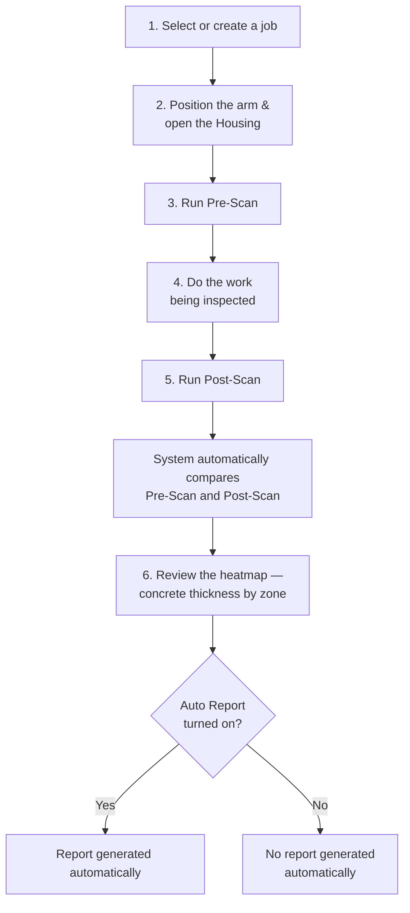

# 6. Daily Operating Procedure (Scan SOP)

Read Chapter 2 (Safety Warnings) before performing any of the steps below.

## Overview

## 1. Select or create a job

[PHOTO: Main View job dropdown]

**To use an existing job:** open the job dropdown at the top of the Main View and pick a project/job. If you pick a job other than the one currently active, confirm the switch when asked.

[PHOTO: Job Number tab, showing project/job list and the "create job" button]

**To create a new job:** go to the **Job Number** tab.
1. Create or select a Project.
2. Create a new Job inside that project — enter the job name, description, target thickness, and tolerance.
3. Add the job to your active list so it appears in the Main View job dropdown.
4. Go back to Main View and select it from the dropdown.

## 2. Position the arm and open the Housing

1. Use the hydraulic arm to bring the Housing close to the concrete surface to be scanned.

   > ⚠️ **NEEDS CONFIRMATION** — the exact controls used to position the hydraulic arm (not identified in the software reviewed so far — confirm whether this is a control in the app, or a separate physical control on the arm/vehicle, and describe the steps here).

2. Press and hold **Open Scanner** to open the Housing; release the button to stop it at any point. Keep your hands clear of the Housing while it moves (see Chapter 2).

[PHOTO: Open Scanner / Close Scanner buttons on the Main View, and the Housing itself partly open]

## 3. Run a Pre-Scan

1. Press **Pre-Scan**.
2. Confirm when asked — starting a new pre-scan overwrites any existing pre-scan already saved for this job.
3. Wait for the scan to finish; the 3D view updates once it's done.

[PHOTO: Pre-Scan confirmation dialog]
[PHOTO: 3D view after a pre-scan finishes]

## 4. Do the work being inspected

> ⚠️ **NEEDS CONFIRMATION** — what happens between the pre-scan and the post-scan (what work or change is being inspected). This is not visible from the software and needs to be described here.

## 5. Run a Post-Scan

1. Press **Post-Scan**.
2. Wait for the scan to finish.
3. The system then compares the pre-scan and post-scan **automatically** — you do not need to press the Compare button in normal use. (Compare is only for manual/advanced re-comparison of already-saved scans — not part of the everyday flow.)

[PHOTO: 3D view after a post-scan finishes]

## 6. Review the result (heatmap)

Once the automatic comparison finishes, the 3D view shows a **heatmap** — a color-coded point cloud where color represents concrete thickness across the scanned area. Use this to visually check for thin or out-of-tolerance zones.

- If **Auto Report** (Setting tab) is **on**, the app then automatically generates the PDF report — wait for the report notification before assuming it's finished.
- If **Auto Report** is **off**, the heatmap is shown but no report is generated automatically.

  > ⚠️ **NEEDS CONFIRMATION** — how to generate/export a report manually when Auto Report is off. No manual "generate report" control was found in the software reviewed so far — confirm whether one exists, or whether turning Auto Report on is the only way to get a PDF.

You can keep using the app (rotate/zoom the heatmap, switch tabs, etc.) while this runs — it no longer freezes the screen.

[PHOTO: heatmap view showing concrete thickness by color, and the "Compare Done" notification]
